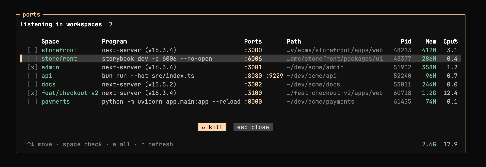
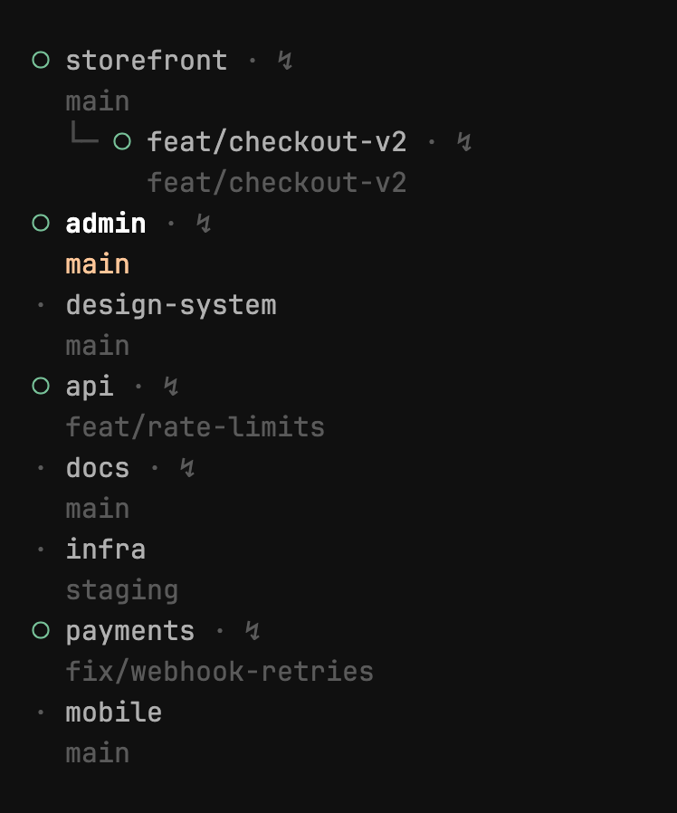

# herdr-ports



See which [herdr](https://herdr.dev) Space has a live server, and kill it: a
`$ports` badge on every Space running a TCP listener, plus a popup to inspect
and kill them.

A listener belongs to a Space when its process cwd sits inside one of the
Space's pane cwds, so servers started outside herdr still show up. There is no
process-name filter. Panes sitting in `/` or `$HOME` are ignored, which keeps
system daemons out.

## Install

```sh
herdr plugin install Numbered-com/herdr-ports
```

Requirements: `jq`, plus the fastest available socket lister - `netstat`
(macOS, built-in), `ss` (Linux, iproute2) or `lsof` (universal fallback; also
used on macOS to resolve process cwds). Bash 3.2+ (stock macOS works).

## Configure

Plugins cannot inject sidebar rows or keybindings (herdr plugin v1), so add to
your `config.toml`:

```toml
# Show the badge next to the Space title
[ui.sidebar.spaces]
rows = [["state_icon", "workspace", "$ports"], ["branch", "git_status"]]

# Open the popup with prefix+a
[[keys.command]]
key = "prefix+a"
type = "plugin_action"
command = "numbered.ports.open"
```

Then `herdr server reload-config`.

## Popup

- The table spans the pane: Space, Program, Ports, Path, then Pid, Mem and Cpu%
  flush right. As the pane narrows, columns drop (Program, Mem and Cpu%, Path,
  Pid), then Ports and Space crop. Long lists scroll with the cursor.
- It refreshes every 3s, and only the screen lines that changed are repainted.
- The bottom line totals Mem and Cpu% of the listed rows under their columns. A
  scrollbar appears when rows overflow.
- Keyboard: arrows or `j` `k` move, `space` checks, `enter` kills the checked
  rows (or the highlighted one), `a` lists every listener on the machine, `r`
  refreshes, `esc` or `q` quits.
- Mouse: click a row to check it, wheel to move, footer hints and chips are
  clickable.
- Kill sends TERM, redraws as soon as the targets exit (stragglers get KILL in
  the background) and clears the Space's badge right away.

| Variable | Default | |
| --- | --- | --- |
| `HERDR_PORTS_REFRESH` | `3` | popup refresh period in seconds, `0` disables |
| `HERDR_PORTS_WHEEL` | `4` | wheel events per cursor step: `4` is one line per notch, `1` follows the terminal |
| `HERDR_PORTS_ACCENT` | `223` | 256-color index of the accent, match your theme |
| `HERDR_PORTS_INTERVAL` | `5` | badge watcher poll period in seconds |
| `HERDR_PORTS_BADGE` | `↯` | badge glyph |

## How the badge works



`herdr-ports watch` polls and posts a `ports` token as workspace metadata with
a TTL, so the badge clears itself shortly after the last server dies. The
watcher is a singleton started by a `pane.created` event hook, no daemon setup
needed. Nerd Font glyphs cannot be used as badge: herdr strips Private Use Area
characters from metadata tokens.

## CLI

```sh
herdr plugin action invoke open --plugin numbered.ports   # open the popup
./herdr-ports list                                        # one-shot table
./herdr-ports watch                                       # run the poller in foreground
```
